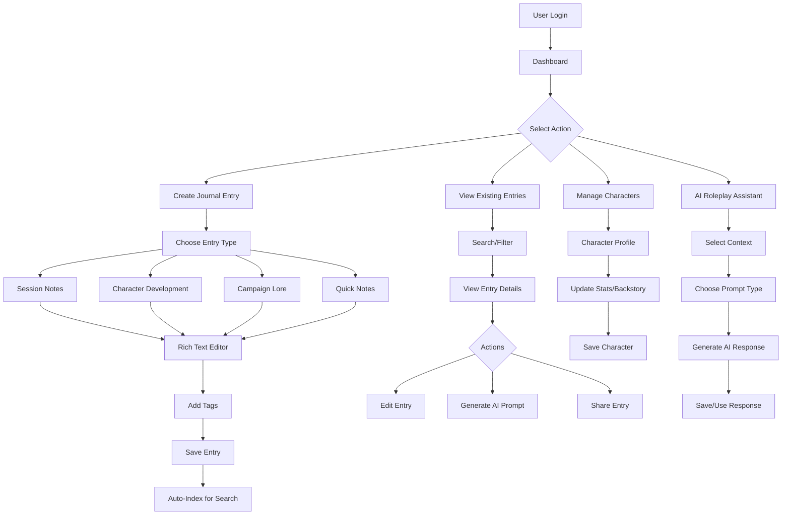
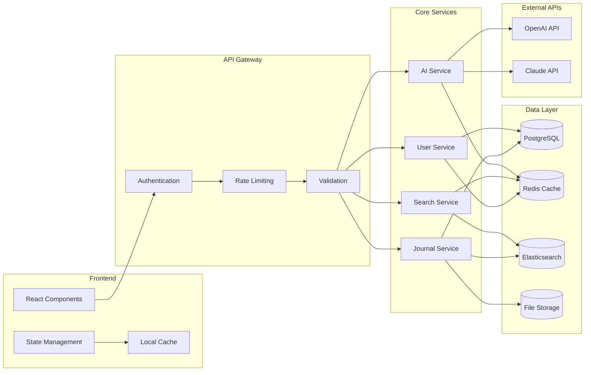
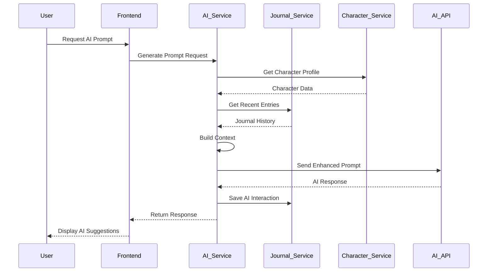
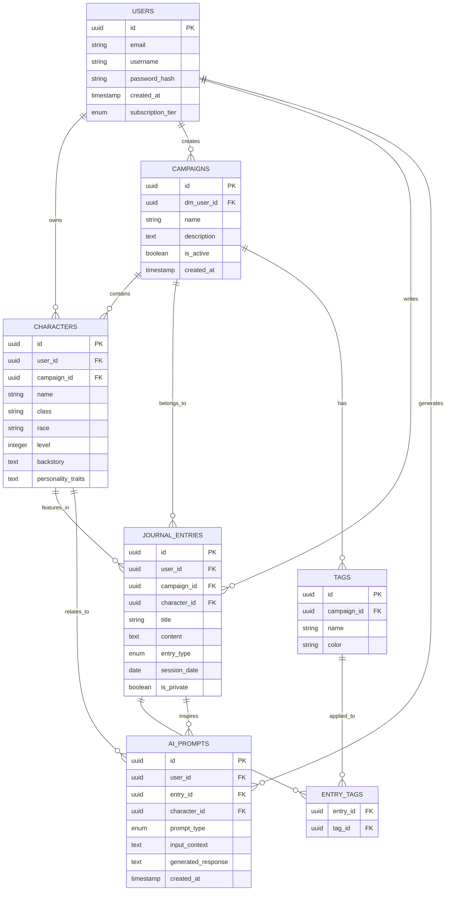
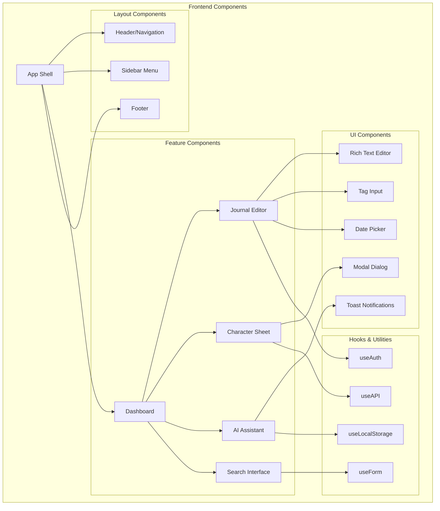
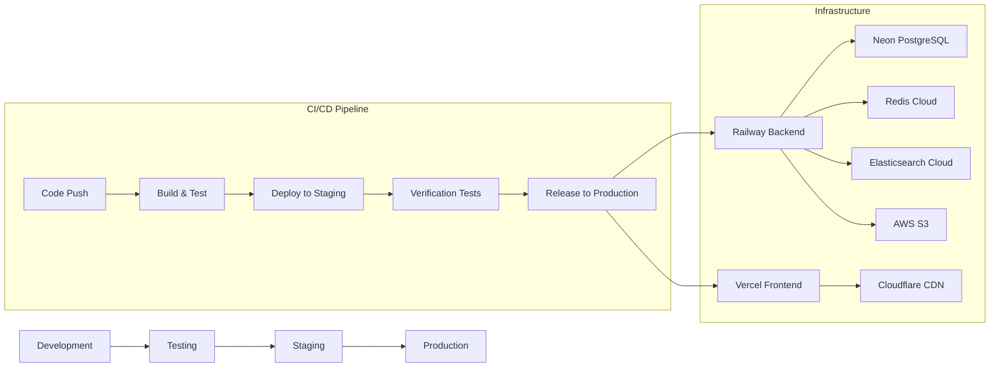

# D&D Journal App - System Flow Diagrams

## User Journey Flow



## Data Flow Architecture



## AI Context Building Flow



## Database Relationship Diagram



## Component Architecture



## API Endpoint Structure

```
/api/v1/
├── auth/
│   ├── POST /login
│   ├── POST /register
│   ├── POST /refresh
│   └── POST /logout
├── users/
│   ├── GET /profile
│   ├── PUT /profile
│   └── DELETE /account
├── campaigns/
│   ├── GET /
│   ├── POST /
│   ├── GET /:id
│   ├── PUT /:id
│   ├── DELETE /:id
│   └── POST /:id/invite
├── characters/
│   ├── GET /
│   ├── POST /
│   ├── GET /:id
│   ├── PUT /:id
│   └── DELETE /:id
├── journal/
│   ├── GET /entries
│   ├── POST /entries
│   ├── GET /entries/:id
│   ├── PUT /entries/:id
│   ├── DELETE /entries/:id
│   └── GET /search
├── ai/
│   ├── POST /generate-prompt
│   ├── GET /prompt-history
│   └── POST /save-interaction
├── tags/
│   ├── GET /
│   ├── POST /
│   ├── PUT /:id
│   └── DELETE /:id
└── files/
    ├── POST /upload
    ├── GET /:id
    └── DELETE /:id
```

## Deployment Flow



This system flow documentation provides a comprehensive view of how users interact with the D&D journal app, how data flows through the system, and how the various components work together to deliver the core functionality.